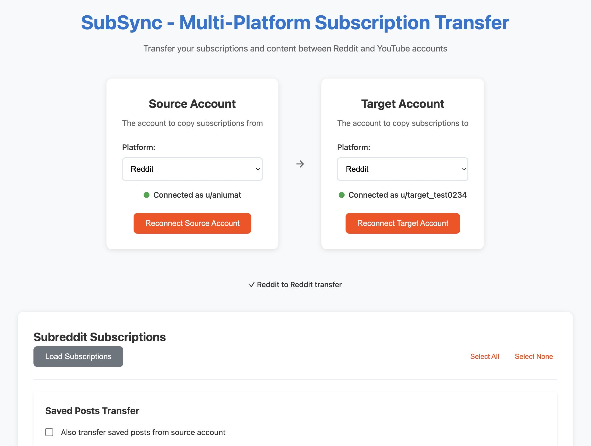
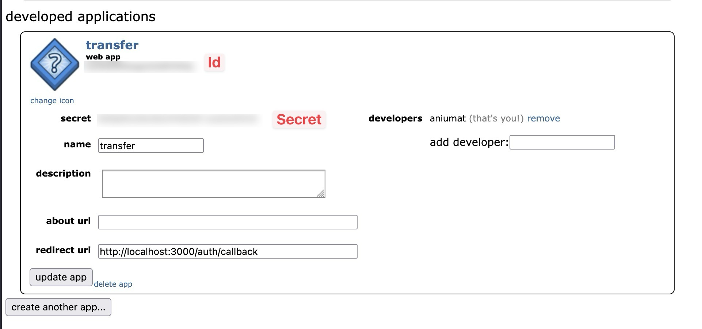

# SubSync - Multi-Platform Subscription Transfer

<p style="margin-bottom:2rem;">A lightweight Docker application built with Bun that transfers subscriptions and content between Reddit and YouTube accounts.</p>



## Features

- **Multi-Platform Support**: Transfer Reddit subscriptions and saved posts, or YouTube subscriptions
- **Dual OAuth Authentication**: Securely connect two accounts on the same platform
- **Subscription Management**: View and select subscriptions from source account
- **Content Transfer**: Transfer saved posts (Reddit only - YouTube playlists WIP)
- **Rate-Limited Transfers**: Respects API limits for both platforms
- **Real-time Progress**: Live transfer progress with detailed logging
- **Error Handling**: Robust error handling for failed transfers
- **Docker Ready**: Containerized for easy deployment

## Prerequisites

### For Reddit

1. Create a Reddit app at https://www.reddit.com/prefs/apps
   - Choose "script" as the application type
   - Set redirect URI to `http://localhost:3000/auth/callback`
   - Note down your client ID and secret



### For YouTube

1. Create a Google Cloud Console project at https://console.cloud.google.com
2. Enable the YouTube Data API v3:
   - Go to "APIs & Services" → "Library"
   - Search for "YouTube Data API v3" and enable it
3. Set up OAuth consent screen:
   - Go to "APIs & Services" → "OAuth consent screen"
   - Choose "External" user type
   - Fill in app name (e.g., "SubSync") and required fields
   - Add scopes: `youtube.readonly`, `youtube.force-ssl`, `userinfo.profile`
4. Create OAuth 2.0 credentials:
   - Go to "Credentials" in the left sidebar
   - Click "Create Credentials" → "OAuth 2.0 Client IDs"
   - Choose "Web application"
   - Add `http://localhost:3000/auth/callback` to authorized redirect URIs
   - Copy the client ID and secret
5. **Important**: Add test users or publish app:
   - If your app is in "Testing" mode, go to "OAuth consent screen"
   - Scroll to "Test users" and add the Google accounts you want to transfer between
   - **OR** click "Publish app" to make it available to any Google user

**⚠️ Note**: YouTube has API quota limitations that restrict large transfers. See [YouTube API Limitations](#youtube-api-limitations) below.

### Runtime

Install Bun from https://bun.sh

## Setup

1. **Clone and setup**:

   ```bash
   cd reddit-transfer-app
   bun install
   ```

2. **Environment Configuration**:

   ```bash
   cp .env.example .env
   ```

   Edit `.env` with your app credentials:

   ```env
   # Reddit OAuth Configuration
   REDDIT_CLIENT_ID=your_reddit_client_id
   REDDIT_CLIENT_SECRET=your_reddit_client_secret
   REDDIT_REDIRECT_URI=http://localhost:3000/auth/callback

   # YouTube OAuth Configuration (Google Cloud Console)
   YOUTUBE_CLIENT_ID=your_google_client_id
   YOUTUBE_CLIENT_SECRET=your_google_client_secret
   YOUTUBE_REDIRECT_URI=http://localhost:3000/auth/callback

   # Application Settings
   PORT=3000
   SESSION_SECRET=your_random_session_secret
   NODE_ENV=development

   # Platform Configuration
   REDDIT_ENABLED=true
   YOUTUBE_ENABLED=true
   ```

   You can disable platforms by setting `REDDIT_ENABLED=false` or `YOUTUBE_ENABLED=false`.

## Development

Start the development server:

```bash
bun run dev
```

Open http://localhost:3000 in your browser.

## Production Deployment

### Using Docker

1. **Build the image**:

   ```bash
   bun run docker:build
   ```

2. **Run with Docker Compose**:
   ```bash
   docker-compose up -d
   ```

### Manual Production

1. **Build the application**:

   ```bash
   bun run build
   ```

2. **Start production server**:
   ```bash
   bun run start
   ```

## Usage

1. **Select Platform**:

   - Choose Reddit or YouTube from the dropdown menus
   - Both source and target must use the same platform

2. **Connect Accounts**:

   - Click "Connect Source Account" to authenticate the account you want to copy from
   - Click "Connect Target Account" to authenticate the account you want to copy to
   - Use separate browser sessions if transferring between your own accounts

> **Note**: I had troubles connecting my account with YouTube OAuth and Firefox, so you might need to use Chrome for this step if using transferring for youtube.

3. **Load Subscriptions**:

   - Click "Load Subscriptions" to fetch subscriptions from the source account
   - Select which items you want to transfer

4. **Optional - Enable Content Transfer**:

   - For Reddit: Check "Also transfer saved posts from source account"

5. **Transfer**:
   - Click "Start Transfer" to begin the process
   - Monitor progress in real-time with detailed logs

## API Endpoints

- `GET /` - Main application interface
- `GET /api/platforms` - List available platforms
- `GET /auth/login?type=source|target&platform=reddit|youtube` - OAuth login flow
- `GET /auth/callback` - OAuth callback handler
- `GET /api/status` - Check authentication status
- `GET /api/subscriptions` - Fetch source account subscriptions
- `POST /api/saved-posts/export` - Export content from source account
- `POST /api/transfer` - Start transfer
- `GET /api/transfer/:id` - Check transfer progress

## Technical Details

### Security Features

- HTTP-only session cookies
- Non-root Docker user
- Environment variable configuration
- CSRF protection via OAuth state parameters

### Error Handling

- Automatic token refresh
- Graceful handling of private/deleted subreddits
- Progress recovery and resumption
- Detailed error logging

## YouTube API Limitations

### Quota Structure

YouTube Data API v3 uses a quota system where each operation consumes "units":

- **Daily limit**: 10,000 units per project (cannot be increased for personal use)
- **Reading subscriptions**: ~1 unit per 50 subscriptions
- **Creating subscriptions**: 50 units per subscription
- **Creating playlists**: 50 units per playlist (disabled)
- **Adding videos to playlists**: 50 units per video (disabled)

### Example

Say you have 200 YouTube subscrptions:

- Reading source subscriptions: ~4 units
- **Creating 200 subscriptions: 10,000 units**
- **Total**: 10,004 units (exceeds daily limit)

### Practical Limitations

- **Small transfers only**: Limited to ~190 subscriptions per day
- **Batch Selection Available**: To help manage large subscription lists, the app includes batch selection controls that let you select subscriptions in increments of 50 or 100 for more controlled transfers

This limitation is imposed by Google/YouTube and affects all third-party applications using their API.

## Troubleshooting

### Common Issues

1. **OAuth Errors**: Verify your app settings and redirect URI in Reddit or Google Cloud Console
2. **Private Content**: Some content may fail if the target account doesn't have access
3. **YouTube API Quota**: Large subscription transfers may hit daily quota limits (see [YouTube API Limitations](#youtube-api-limitations))
4. **Transfer Speed**: YouTube transfers are slower due to API rate limits

### Logs

Check application logs for detailed error information:

```bash
docker-compose logs -f reddit-transfer-app
```

## Privacy & Account Separation

### How Accounts Are Kept Separate

- **Independent OAuth Sessions**: Each account authenticates separately with Reddit
- **Separate API Tokens**: Source and target accounts use different access tokens
- **No Cross-Contamination**: The app acts as an independent intermediary without linking credentials

### What Reddit Can See

**Reddit CANNOT directly see that accounts are connected** because:

- Each account makes independent API calls using its own tokens
- No shared identifiers or linking information is sent to Reddit
- The app doesn't expose any connection between the accounts in API requests

**Reddit MIGHT be able to correlate accounts through:**

- **IP Address**: Both accounts authenticate from the same IP address
- **Timing Patterns**: Rapid subscription additions to the target account shortly after source account activity
- **Subscription Overlap**: Target account suddenly subscribing to many of the same subreddits

### Privacy Best Practices

For maximum privacy, consider:

- Using different networks (VPN, mobile vs WiFi) for each account
- Adding delays between authentication and transfers
- Using separate browser sessions or incognito mode

## License

MIT License

## Disclaimer

This application is not affiliated with Reddit, Youtube, or Google. Use responsibly and in accordance with the former's Terms of Service and API guidelines.
